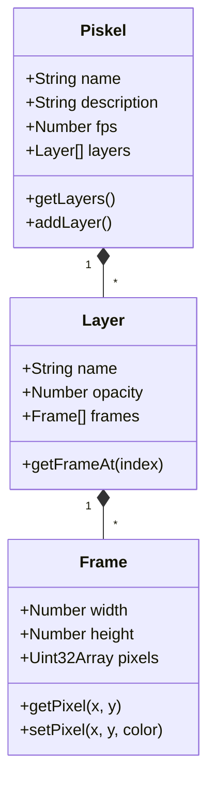

# Implementation Plan & Piskel Analysis - Standalone React Pixel Editor

This unified document contains the codebase analysis of [Piskel](https://github.com/piskelapp/piskel), scoping decisions, and the technical implementation plan for building a lightweight, single-frame pixel editor (similar to Aseprite) as a standalone sub-project in React + TypeScript.

---

## 1. Piskel Codebase Architecture Analysis

Piskel is a legacy single-page web app built on ES5/ES6, jQuery, Bootstrap 2, and Grunt. Its core design separates data models, UI controllers, and paint tools.

### 1.1 Core Data Model (`src/js/model/`)
Piskel's internal project data is structured hierarchically:



*   **`Piskel.js`**: Top-level project container holding project metadata (name, description, canvas dimensions) and an array of layers.
*   **`Layer.js`**: Manages a single canvas layer (opacity, name, blending visibility) and holds an array of `Frame` objects representing the animation timeline.
*   **`Frame.js`**: Represents a single 2D grid of pixels. It wraps a raw pixel buffer (Uint32Array or a canvas 2D context) and provides basic pixel manipulation methods (`getPixel`, `setPixel`, `clear`, etc.).

### 1.2 Core UI Controllers (`src/js/controller/`)
*   **`PiskelController.js`**: Core controller managing active layer, active frame, active tool, and project properties.
*   **`DrawingController.js`**: Captures pointer events (click, drag, release) on the drawing canvas, translates screen coordinates to pixel grid indices based on camera scale/zoom, and forwards actions to the active tool.
*   **`HistoryService.js`**: The undo/redo manager. It periodically creates serialized state checkpoints (snapshots) of all layers and frames, allowing the user to step backwards or forwards.
*   **`CanvasController.js`**: Manages the main workspace viewport layout, canvas grids, and user viewport interactions (such as mouse-wheel zoom).

### 1.3 Tool System (`src/js/tools/`)
*   **`BaseTool.js`**: The abstract base class defining pointer event lifecycle callbacks (`mousedown`, `mousemove`, `mouseup`).
*   **Tool Subclasses**:
    *   `SimplePen.js`: Basic pixel drawing with adjustable brush sizes.
    *   `Eraser.js`: Sets matching pixel coordinates to transparent.
    *   `PaintBucket.js`: Performs flood-fills using contiguous matching color checks.
    *   `Stroke.js`: Draws lines using vector paths.
    *   `Rectangle.js` / `Circle.js`: Generates shapes on mouse release.
    *   `ColorPicker.js`: Queries the color value under the cursor.

---

## 2. Scoping Decoupled Image Editor

To transform Piskel's editing philosophy into a pure **image editor (no animation)**, the following scoping constraints are applied:

| Feature in Piskel | Action Required for Image-Only Editor |
| :--- | :--- |
| **Frames list (Left sidebar)** | Remove/hide. The data model is clamped to exactly `FrameCount = 1` across all layers. |
| **Preview panel (Right sidebar)** | Remove. Loop animation playback of frames is redundant. |
| **FPS slider / Onion skinning** | Remove. |
| **Layers panel (Right sidebar)** | Keep. Multi-layer drawing is highly useful for static art composition. |
| **Drawing canvas (Center)** | Keep. This is the main editing viewport. |
| **Export functions** | Disable Animated GIF and Zip sheet exports. Support PNG and local project JSON saving only. |

---

## 3. Option B Technical Implementation Plan

This section details how the lightweight React pixel editor will be built as a standalone Vite sub-project named `pixel_editor/` in the workspace root.

### 3.1 Directory Structure
```
pixel_editor/
├── package.json            # Vite dependencies (React, TS, Vite)
├── tsconfig.json           # Compiler rules
├── vite.config.ts          # Vite asset pipeline configuration
├── index.html              # HTML entry point wrapper
└── src/
    ├── main.tsx            # Main application mounting script
    ├── types.ts            # TypeScript interfaces (Layer, Tool, EditorState)
    ├── PixelEditor.tsx     # Root container, Toolbar, Layer List, Color Palette
    ├── CanvasView.tsx      # Interactive Canvas Viewport (Draw, Zoom, Pan)
    ├── styles.css          # Styling stylesheet using CSS variables
    └── utils/
        ├── floodFill.ts    # Fast queue-based flood fill algorithm
        ├── drawHelpers.ts  # Line (Bresenham's), Rect, Circle calculations
        └── history.ts      # State history manager for undo/redo
```

### 3.2 Types & Models (`pixel_editor/src/types.ts`)
We will store layer states as standard browser `ImageData` in memory for easy cloning:
```typescript
export interface Layer {
  id: string;
  name: string;
  visible: boolean;
  opacity: number;      // 0.0 to 1.0
  pixels: ImageData;    // Raw RGBA pixel buffers
}

export type ToolType = 'pen' | 'eraser' | 'bucket' | 'line' | 'rect' | 'circle' | 'picker';

export interface Point {
  x: number;
  y: number;
}
```

### 3.3 Main Editor UI Layout (`pixel_editor/src/PixelEditor.tsx`)
A modern, dark-themed pixel editor layout:
- **Dimension Settings**: Allows the user to select from preset sizes (16x16, 32x32, 64x64, 128x128) or input custom sizes, clamped to a maximum ceiling of **256x256**.
- **Left Panel (Toolbar)**: Tool selectors (Pen, Eraser, Fill, Shapes) and Brush size selector.
- **Center Canvas**: Interactive pan/zoom workspace.
- **Right Panel (Layers & Colors)**:
  - Color swatches, active primary/secondary color, hex input.
  - Layer manager: list layers, adjust layer opacity, toggle visibility, and drag-and-drop layer reordering.
- **Top Actions Panel**: Undo, Redo, Grid toggle, Export PNG.

### 3.4 Canvas Viewport & Drawing Logic (`pixel_editor/src/CanvasView.tsx`)
- **Rendering Stack**: Composites all visible layers from bottom to top onto a single offscreen canvas based on layer opacities.
- **Transformations**: Applies translate and scale transform rules to map the composited canvas to the center of the viewport. Supports wheel zoom and middle-drag/space-drag panning.
- **Stroke Commit**: Coordinates are mapped from screen spaces `(clientX, clientY)` to grid cells `(px, py)`. Points are interpolated using Bresenham's line algorithm during mouse drag so fast movement does not cause dotted lines. On mouse release, changes are pushed onto the history stack.

### 3.5 Helper Algorithms (`pixel_editor/src/utils/`)
- **`floodFill.ts`**: Queue-based iterative flood-fill algorithm directly modifying `ImageData.data` (Uint8ClampedArray) to prevent browser stack overflow.
- **`drawHelpers.ts`**: Implements line rendering, circle bounds, and solid/outline rectangles.
- **`history.ts`**: Deep-clones the list of layer `ImageData` objects on each committed operation, storing them in memory-bounded undo/redo stacks.

---

## 4. Proposed Workspace Integration Changes

### 4.1 [MODIFY] [index.html](file:///d:/godot_exe/adna_tilemap_editor/server/index.html)
Add a fifth entry card for the **Pixel Editor**:
```html
<a class="card" href="/pixel_editor/">
  <div class="ico">🎨</div>
  <h2>Pixel Editor</h2>
  <p id="card5-desc">轻量级像素画编辑器，支持多图层编辑、网格绘制、橡皮擦与油漆桶，导出透明 PNG。</p>
  <div class="go" id="card5-go">打开应用 →</div>
</a>
```
Add corresponding translations for ID `card5-desc` and `card5-go` (Chinese and English) in the `TRANSLATIONS` script object inside [server/index.html](file:///d:/godot_exe/adna_tilemap_editor/server/index.html).

### 4.2 [MODIFY] [deploy.sh](file:///d:/godot_exe/adna_tilemap_editor/server/deploy.sh)
Modify the deploy script to build and publish the new `pixel_editor` sub-project:
```bash
echo "==> building pixel_editor"
( cd "$REPO/pixel_editor" && npm ci && npm run build )

# Add copy step:
sudo mkdir -p ... "$WEBROOT/pixel_editor"
sudo rsync -a --delete "$REPO/pixel_editor/dist/" "$WEBROOT/pixel_editor/"
```

---

## 5. Verification Plan

### Automated Tests
* Create unit tests under `pixel_editor/src/__tests__/` to verify:
  - Bresenham's algorithm correctness.
  - Flood fill bounds limits and replacement logic.
  - History undo/redo state stack consistency.

### Manual Verification
1. Open the main portal page in the browser, check for the new entry card, and verify English/Chinese translations.
2. Click the card, open `/pixel_editor/`, select a dimension (e.g. 32x32), and paint continuous lines with the pen tool.
3. Add multiple layers, verify transparency overlays, adjust visibility and opacity, and check drawing depth order.
4. Zoom and pan the canvas to ensure responsive rendering.
5. Verify Undo/Redo commands using keyboard shortcuts (`Ctrl+Z`, `Ctrl+Y`).
6. Click "Export PNG" and check if the resulting file preserves layers, canvas resolution, and transparency.
