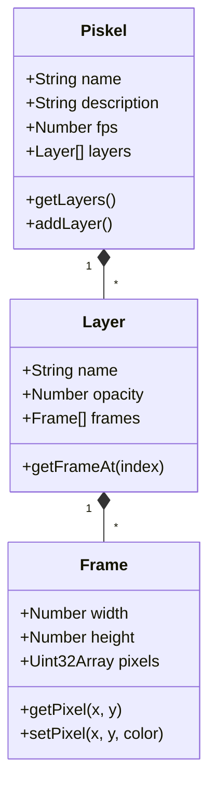
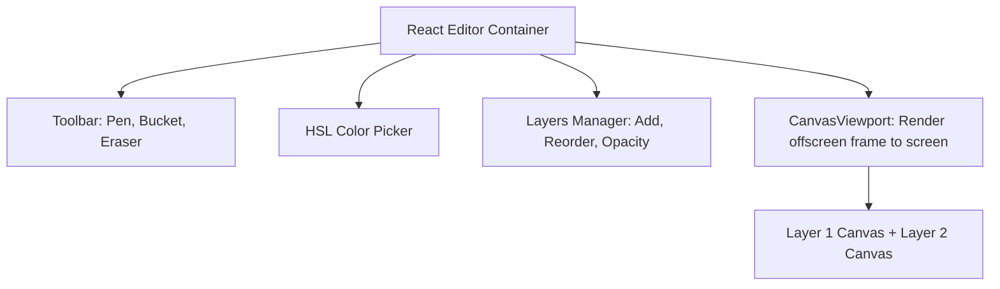

# Piskel Codebase Analysis & Pixel Editor Solution

This document analyzes the open-source [Piskel](https://github.com/piskelapp/piskel) repository and provides integration solutions for building a simple image editor (similar to Aseprite) that supports layered drawing and pixel editing tools but **excludes all animation and timeline capabilities**.

---

## 1. Piskel Codebase Architecture

Piskel is a single-page web application written in ES5/ES6 JavaScript. It relies on a legacy front-end stack and is built using **Grunt**. 

### 1.1 Core Data Model (`src/js/model/`)
Piskel's data model is organized hierarchically:



*   **`Piskel.js`**: The root model representing a project. It manages the metadata (name, dimensions, fps) and maintains an ordered list of `Layer` instances.
*   **`Layer.js`**: Represents an editor layer. Each layer manages its opacity, name, and an ordered list of `Frame` instances (corresponding to the animation timeline).
*   **`Frame.js`**: Holds the actual pixel data (as a 1D pixel buffer or canvas context) and width/height dimensions. It provides low-level pixel manipulation methods (`getPixel`, `setPixel`, `clear`, etc.).

### 1.2 Core UI Controllers (`src/js/controller/`)
*   **`PiskelController.js`**: The central controller coordinating the active layer, active frame, and active tool.
*   **`DrawingController.js`**: Listens to mouse/pointer events on the drawing canvas, calculates coordinates relative to the viewport/zoom, and forwards drawing actions to the active tool.
*   **`HistoryService.js`**: Manages the undo/redo stack. It saves serialized snapshots (checkpoints) of the layers and frames to revert or restore states.
*   **`CanvasController.js`**: Configures the main editor canvas, grid overlays, and handles zoom/pan actions.

### 1.3 Tool System (`src/js/tools/`)
*   **`BaseTool.js`**: Abstract parent class defining the lifecycle of a drawing operation (`mouseup`, `mousedown`, `mousemove`).
*   **Subclass Tools**: Individual files in `src/js/tools/` implement specific operations:
    *   `SimplePen.js`: Basic drawing with selected brush size.
    *   `Eraser.js`: Sets matching pixels to transparent.
    *   `PaintBucket.js`: Flood-fills contiguous pixels of the same color.
    *   `Stroke.js`: Draws straight lines.
    *   `Rectangle.js`/`Circle.js`: Renders shapes.
    *   `ColorPicker.js`: Picks colors from the canvas.
    *   `Move.js`: Pans the canvas content.

---

## 2. Animation vs. Image Editor Scope

To convert Piskel into a pure **image editor (no animation)**, we need to address two aspects: **UI Presentation** and **Data Model Restrictions**.

| Feature in Piskel | Action Required for Image-Only Editor |
| :--- | :--- |
| **Frames list (Left sidebar)** | Remove or hide entirely. The project must enforce exactly `FrameCount = 1`. |
| **Preview panel (Right sidebar)** | Remove. The loop animation playback is redundant for a single static image. |
| **FPS slider / Onion skinning** | Remove. |
| **Layers panel (Right sidebar)** | Keep. Multi-layer drawing is useful for Aseprite-like editing. |
| **Drawing canvas (Center)** | Keep. This is the main editing viewport. |
| **Export functions** | Disable Animated GIF and Zip sheet exports. Restrict exports to PNG/PNG spritesheets or custom JSON configurations. |

---

## 3. Implementation Solutions

Since the user workspace uses a modern stack (**Vite + React + TypeScript** in `reroll/`, `refiner/`, and `tagger/`), we have two primary approaches:

### Solution A: Embedding & Customizing Piskel (Legacy Approach)
This approach involves bringing the Piskel codebase into your workspace as static assets and modifying its entry point to run as a single-frame editor.

#### Steps:
1.  Clone Piskel into a static asset directory (e.g., `public/piskel/`).
2.  Modify the build or edit the source directly to disable/hide the animation modules:
    *   **Hide via CSS**: Add styling in `piskel.css` to hide `.preview-container` (preview window) and `.timeline-container` (left-hand frame list).
    *   **Disable Frame Operations**: In `PiskelController.js`, clamp frame counts to `1` and disable the shortcut keys for adding/duplicating frames (`Alt+N`, etc.).
3.  Implement communication via `window.postMessage()` (similar to `piskel-embed`) to load initial images into the editor and save edited canvases.

#### Pros & Cons:
*   👍 **Pros**: You get Piskel's extensive toolset (dithering, shading, advanced selections) out of the box with minimal custom canvas code.
*   👎 **Cons**:
    *   **Tech Stack Bloat**: Piskel relies on jQuery, Bootstrap 2, spectrum color picker, and custom AMD module structures. It's difficult to bundle inside modern Vite projects.
    *   **Performance Overhead**: Large bundle sizes (~1.5MB of legacy scripts).
    *   **UI Mismatch**: It doesn't match the modern CSS/layout style of your React apps.

---

### Solution B: Building a Lightweight React Pixel Editor (Recommended)
Given that you have already built a highly performant **Vite + React + Canvas 2D** rendering engine in the `reroll/` module (with pan, zoom, drawing overlays, and an active undo/redo stack in `commands.ts`), building a native React pixel editor component is the cleanest and most maintainable path.



#### Core Components to Implement:

1.  **Canvas State**:
    ```typescript
    interface LayerData {
      id: string;
      name: string;
      visible: boolean;
      opacity: number;
      canvas: HTMLCanvasElement; // Holds the actual pixel data
    }
    ```
2.  **Drawing Tools (Base Pattern)**:
    Create a tool dispatcher that receives `(ctx, x, y, color, size)` from pointer events:
    *   **Pen**: `ctx.fillStyle = color; ctx.fillRect(x - halfSize, y - halfSize, size, size)`
    *   **Eraser**: `ctx.clearRect(x - halfSize, y - halfSize, size, size)`
    *   **Flood Fill**: Implement a simple queue-based flood fill (flood-fill algorithm) using `ctx.getImageData()` and `ctx.putImageData()`.
3.  **Viewport Pan/Zoom**:
    Reuse the exact pan/zoom logic from your `CanvasView.tsx` component in `reroll/`.
4.  **Undo/Redo**:
    Store a stack of historical image buffers or use a command pattern to redraw changed bounding boxes.

#### Pros & Cons:
*   👍 **Pros**:
    *   **Zero Bloat**: Built directly inside React, compiling in milliseconds, with no legacy dependencies.
    *   **Consistency**: Fits seamlessly with your existing UI tokens, styling systems, and components.
    *   **Maintainable**: Pure TypeScript, easily debuggable, and integrated directly into the workspace.
*   👎 **Cons**:
    *   Requires writing the flood-fill and line/rectangle drawing helper functions manually (approx. 150 lines of clean canvas utility functions).

---

## 4. Summary & Recommendation

For a clean, lightweight image modification feature, **Solution B (Custom React Editor)** is highly recommended. 
It capitalizes on the Canvas 2D expertise already present in your project (`reroll/` and `tagger/`) and provides a modern, fast, and native editing experience without dealing with Piskel's legacy build processes.

However, if you want a complete, ready-made toolbar containing advanced features like dithering, rotation, and color replacements immediately, **Solution A** can be achieved by integrating a customized Piskel build via an `iframe`.
